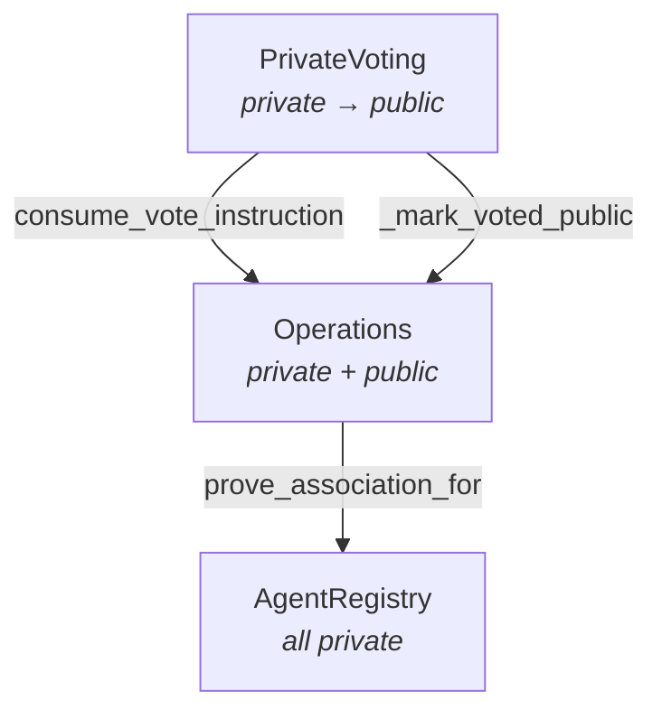
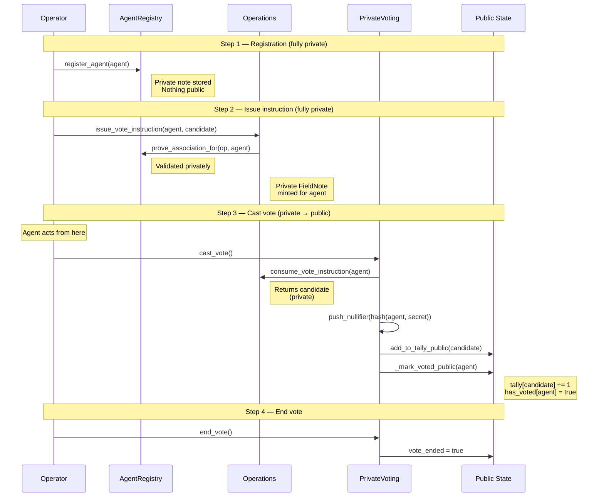
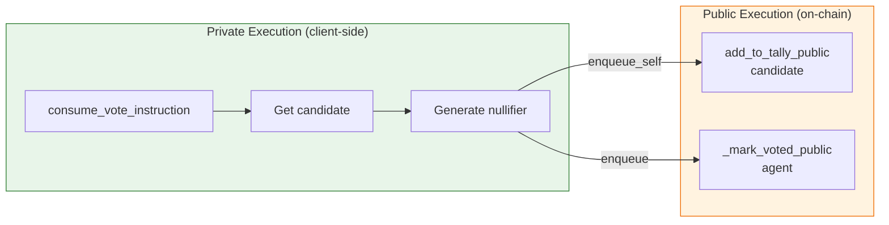
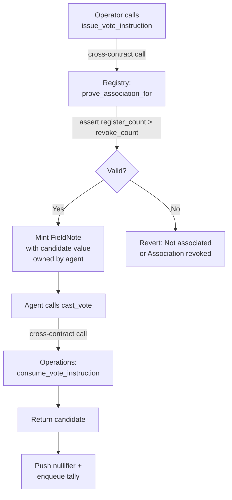
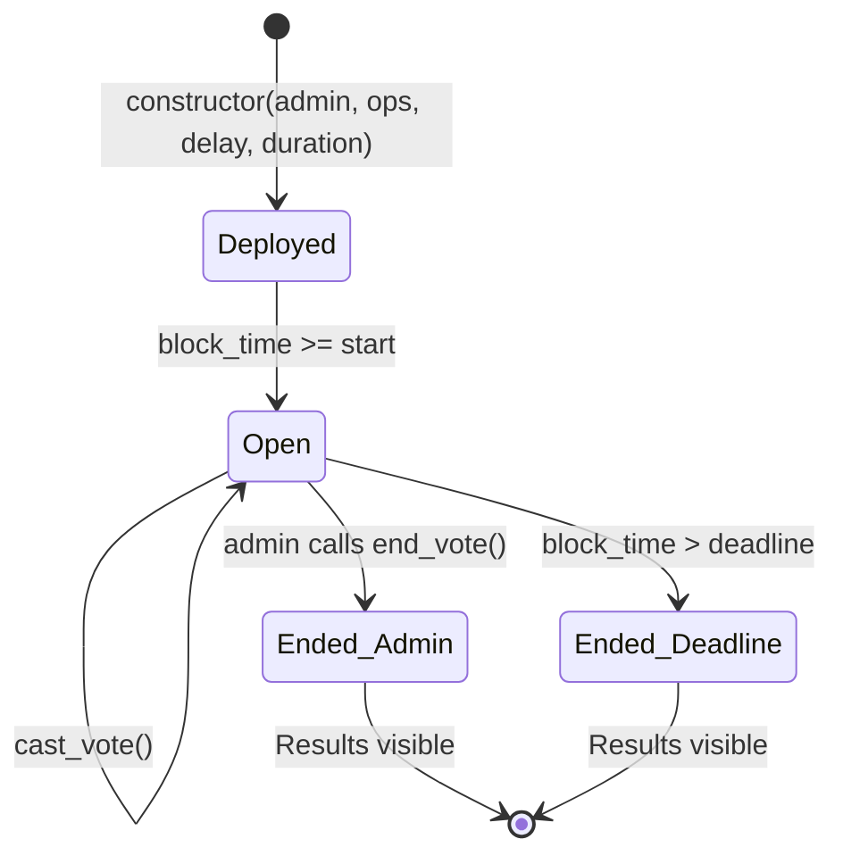
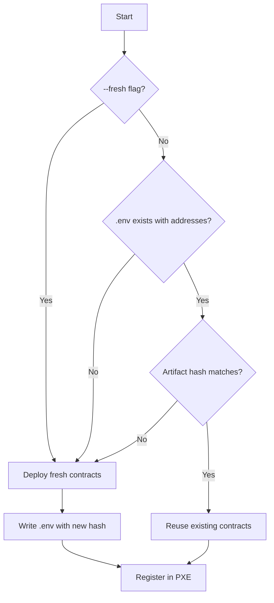

# Aztec-Ballot — Technical Guide

## Table of Contents

1. [Overview](#overview)
2. [Contract Architecture](#contract-architecture)
3. [Private vs Public Data Flow](#private-vs-public-data-flow)
4. [Operator → Agent Control Flow](#operator--agent-control-flow)
5. [Registration & Authorization](#registration--authorization)
6. [Voting Lifecycle](#voting-lifecycle)
7. [Security, Privacy & Scalability](#security-privacy--scalability)
8. [Discovered Gotchas & Limitations](#discovered-gotchas--limitations)
9. [Future Enhancements](#future-enhancements)

---

## Overview

Aztec-Ballot demonstrates **delegated private voting** on the Aztec Network. The core idea: **hide all public information about the operator**. An operator privately registers an agent, privately sends a vote instruction, and the agent executes the vote. Only the vote tally and the agent's "has voted" flag become public — the operator's identity, the operator-agent association, and the candidate choice all remain private until the tally is incremented.

### Roles

| Role | Description |
|---|---|
| **Operator** | The principal. Decides which candidate to vote for. Registers/unregisters agents. Never appears on-chain publicly. |
| **Agent** | The delegate. Receives a private vote instruction and executes it. Their address appears publicly only in the `has_voted` flag. |
| **Admin** | The vote administrator (= deployer). Can call `end_vote()` to close voting early. Separate from operator in production; same account in the demo for simplicity. |

### Contract Stack



---

## Key Concepts

### 1. Private Execution Environment (PXE)

The PXE is a **client-side component** that:

- Generates zero-knowledge proofs locally
- Manages encrypted state
- Interacts with the Aztec Node

**Why it matters**: Proofs are generated on YOUR machine, meaning the network never sees your raw vote data.

### 2. Nullifiers

A **nullifier** is a unique cryptographic value that:

- Is derived from your address + secret key
- Prevents double-voting
- Doesn't reveal your identity

```noir
// From contracts/voting/src/main.nr
let npk_hash = get_public_keys(agent).npk_m.hash();
let secret = self.context.request_nsk_app(npk_hash);
let nullifier = poseidon2_hash([agent.to_field(), secret]);
self.context.push_nullifier(nullifier);
```

### 3. Sponsored Fee Payment

Instead of users paying transaction fees, this application uses **Sponsored FPC** (Fee Payment Contract):

- A special contract pays fees on behalf of users
- Users don't need native tokens to interact
- Perfect for demos and onboarding

### 4. Zero-Knowledge Proofs

When you vote, the application:

1. Generates a proof that says "I have a valid vote instruction, and I haven't voted before"
2. Sends the proof to the network
3. The network verifies the proof WITHOUT seeing your vote details

Proofs are disabled by default for sandbox development (the sandbox accepts unproven transactions). Enable with `PROVER_ENABLED=true` for testnet/mainnet.

---

## Contract Architecture

### AgentRegistry

The single source of truth for operator↔agent associations. **Entirely private** — no public state at all.

```noir
Storage {
    associations: Owned<PrivateSet<FieldNote>>  // operator → agent notes
    revocations:  Owned<PrivateSet<FieldNote>>  // operator → revoke notes
}
```

| Function | Visibility | Purpose |
|---|---|---|
| `register_agent(agent)` | Private | Insert association note |
| `unregister_agent(agent)` | Private | Insert revocation note |
| `prove_association_for(operator, agent)` | Private | Assert `register_count > revoke_count` |

**Re-registration** uses count-based logic: an agent is active if they've been registered more times than revoked. This avoids the need to nullify/destroy old notes.

### Operations

Bridges the operator's private intent to the agent. Stores vote instructions as private notes and tracks voting status publicly.

```noir
Storage {
    registry:          PublicImmutable<AztecAddress>          // trusted registry
    vote_instructions: Owned<PrivateSet<FieldNote>>           // agent-owned notes
    has_voted:         Map<AztecAddress, PublicMutable<bool>>  // public flag
}
```

| Function | Visibility | Purpose |
|---|---|---|
| `constructor(registry_addr)` | Public | Set trusted registry address |
| `issue_vote_instruction(agent, candidate)` | Private | Prove association via registry, mint instruction note |
| `consume_vote_instruction(agent)` | Private | Read instruction note, return candidate |
| `_mark_voted_public(agent)` | Public | Set `has_voted[agent] = true` |
| `get_has_voted(agent)` | Public | Read voted flag |

### PrivateVoting

The tally contract. Receives the candidate via cross-contract call, pushes a nullifier to prevent double-voting, and increments the public tally.

```noir
Storage {
    admin:                   PublicMutable<AztecAddress>
    tally:                   Map<Field, PublicMutable<Field>>
    vote_ended:              PublicMutable<bool>
    vote_start_timestamp:    PublicImmutable<u64>
    vote_deadline_timestamp: PublicImmutable<u64>
    operations_contract:     PublicImmutable<AztecAddress>
}
```

| Function | Visibility | Purpose |
|---|---|---|
| `constructor(admin, ops_addr, delay, duration)` | Public | Initialize with time window |
| `cast_vote()` | Private | Consume instruction → nullifier → enqueue tally |
| `add_to_tally_public(candidate)` | Public (only_self) | Increment tally within time window, checks `vote_ended` |
| `end_vote()` | Public | Admin ends voting early |
| `get_vote(candidate)` | Utility | Read tally (only after vote ends) |
| `is_vote_finished()` | Utility | Check if ended (by admin or deadline) |
| `get_start_timestamp()` | Utility | Read start time |
| `get_deadline_timestamp()` | Utility | Read deadline time |

---

## Private vs Public Data Flow



### What is Private vs Public

| Data | Private | Public |
|---|---|---|
| Operator identity | ✅ Never revealed | |
| Operator↔Agent association | ✅ Private notes only | |
| Candidate choice (during voting) | ✅ Encrypted in note | |
| Which candidate gets a tally increment | | ✅ Visible |
| Agent's `has_voted` flag | | ✅ Visible |
| Vote tally per candidate | | ✅ Visible (after vote ends) |
| Nullifier (prevents double vote) | | ✅ Published (unlinkable to agent) |
| `vote_ended` flag | | ✅ Visible |

### The Privacy Boundary

The critical transition happens in `cast_vote()`:



The private portion runs on the client (PXE generates a ZK proof). The public portion executes on the network. The proof guarantees the transition is valid without revealing the private inputs.

---

## Operator → Agent Control Flow

### How Private Validation Works

The key insight: **the operator never directly touches the voting contract**. Instead, a chain of private validations enforces control:



**Why this doesn't leak associations:**

1. `prove_association_for` is a **private function** — the proof runs client-side. The network only sees the proof is valid, not which operator/agent pair was checked.
2. The vote instruction is a **private note** owned by the agent. Only the agent can read it.
3. `cast_vote()` is called by the **agent**, not the operator. The operator's address never appears in the voting transaction.
4. The nullifier is derived from `hash(agent_address, secret)` — it cannot be linked back to the operator.

### What an Observer Sees

An external observer monitoring the public chain sees:
- `tally[3] += 1` (some candidate got a vote)
- `has_voted[agent_addr] = true` (this agent voted)
- A nullifier was published (prevents replay)

They **cannot** determine:
- Which operator controls this agent
- That the operator chose candidate 3
- Whether this agent is associated with any other agents

---

## Registration & Authorization

### Count-Based Re-registration

Rather than destroying old notes (which would require nullifiers and increase circuit size), the registry uses an append-only count comparison:

```
register_agent(agent)  → associations += FieldNote(agent)
unregister_agent(agent) → revocations += FieldNote(agent)
prove_association_for(op, agent):
    register_count = count(associations where value == agent)
    revoke_count   = count(revocations where value == agent)
    assert register_count > revoke_count
```

**Trade-off**: Notes accumulate over time (never deleted). This is bounded by the iteration limit (see [Discovered Gotchas](#discovered-gotchas--limitations)).

### Authorization Chain

```
Operator registers Agent in Registry
         │
         ▼
Operator calls Operations.issue_vote_instruction(agent, candidate)
         │
         ├── Operations calls Registry.prove_association_for(operator, agent)
         │   └── Asserts register_count > revoke_count ✓
         │
         └── Mints FieldNote { value: candidate } owned by agent
```

The agent cannot forge an instruction (only `issue_vote_instruction` can mint notes into `vote_instructions`). A rogue operator cannot issue instructions for an agent they haven't registered (the registry proof fails).

---

## Voting Lifecycle



### Time Window

The constructor computes absolute timestamps from the block timestamp at deploy time:

```noir
let now = self.context.timestamp();
let start = now + vote_start_delay_seconds;
let deadline = start + vote_duration_seconds;
```

Default values (configured in `deploy.ts`, single source of truth):
- `VOTE_START_DELAY_SECONDS = 0` (open immediately)
- `VOTE_DURATION_SECONDS = 7200` (2 hours)

**Sandbox note**: The sandbox advances block timestamps ~10 minutes per block, which is disconnected from wall-clock time. The demo uses a 2-hour window and an "End vote early" admin action to work around this. On a production network (Aztec L2 on Ethereum L1), block timestamps track real UTC.

### Early End Detection

The CLI demo checks `is_vote_finished()` before every voting action. If the admin has ended the vote early:
- The voting window status shows **"ENDED EARLY — admin ended the vote"** instead of "OPEN"
- Attempts to vote or issue instructions are blocked client-side with a clear error
- If a transaction still reaches the contract, `add_to_tally_public` asserts `vote_ended == false`

### Results Visibility

`get_vote(candidate)` and `is_vote_finished()` are **utility functions** (unconstrained, free to call). Results are gated:

- If `vote_ended == true` → results visible (admin ended early)
- Else if `block_time > deadline` → results visible (natural expiry)
- Otherwise → `assert` fails, results hidden

---

## Script Architecture

### Shared Deploy Logic

`deploy.ts` is both a standalone script and a library. It exports:

| Export | Purpose |
|---|---|
| `deployContracts(wallet, deployer, options?)` | Deploy all 3 contracts with any wallet |
| `writeEnvFile(info, path?, nodeUrl?)` | Persist deployment info to `.env` |
| `computeArtifactsHash()` | SHA-256 of artifact JSON files (change detection) |
| `VOTE_START_DELAY_SECONDS` | Single source of truth for vote timing |
| `VOTE_DURATION_SECONDS` | Single source of truth for vote timing |
| `DeploymentInfo` | Type for deployment results |

### Auto-Deploy Detection

The CLI demo (`cli-demo.ts`) automatically determines whether to deploy on startup:



The artifact hash is a SHA-256 digest of the three compiled contract JSON files. When you run `yarn build-contracts`, the artifacts change, the hash changes, and the next `yarn start` auto-redeploys.

---

## Security, Privacy & Scalability

### Privacy Guarantees

| Guarantee | Mechanism |
|---|---|
| Operator identity hidden | All operator actions are private functions; address never in public state |
| Association hidden | Registry is fully private; `prove_association_for` runs client-side |
| Vote choice hidden | Candidate travels as private note; only tally increment is public |
| Double-vote prevention | Nullifier = `poseidon2(agent_address, nsk_app)` — deterministic per agent |
| Unlinkable nullifiers | Nullifier cannot be reversed to reveal agent identity |

### Security Considerations

| Concern | Status |
|---|---|
| **Rogue operator** | Cannot issue instructions for unregistered agents (registry proof fails) |
| **Rogue agent** | Cannot forge instruction notes (only `issue_vote_instruction` can mint them) |
| **Admin abuse** | Admin can only end voting, not alter tallies or votes |
| **Front-running** | Private functions execute client-side; transaction contents are encrypted |
| **Note confidentiality** | Notes are encrypted to the owner's public key; only the owner can decrypt |

### Fee / Gas Implications

- All transactions use **SponsoredFPC** (sponsored fee payment) — no native tokens needed
- Each private function generates a ZK proof client-side (1-10 seconds depending on circuit size)
- Cross-contract calls (e.g., `cast_vote → consume_vote_instruction → prove_association_for`) increase proof generation time but remain within a single transaction
- `prove_association_for` performs two `get_notes` calls (associations + revocations), which is the most expensive operation in the system

---

## Discovered Gotchas & Limitations

### 1. Private Iteration Constraints

**Problem**: `get_notes` returns a `BoundedVec` and Noir requires compile-time loop bounds. The iteration limit is hardcoded:

```noir
for i in 0..16 {  // Max 16 notes per get_notes call
    if i < len { ... }
}
```

**Impact**: An operator can register at most ~16 unique agents before hitting the iteration ceiling in `prove_association_for`. In practice, accumulated register+revoke notes for the same agent also count toward this limit.

### 2. CRS (Common Reference String) Constraint

**Problem**: Each `get_notes` call adds significant gates to the circuit. Having more than ~1 `get_notes` per private function can exceed the cached CRS size, causing proof generation failure.

**Impact**: `prove_association_for` already uses 2 `get_notes` calls (associations + revocations) — this is at the practical limit.

### 3. Registry Growth (Append-Only Notes)

**Problem**: Registration and revocation notes are never deleted. Each `register_agent` / `unregister_agent` call appends a new note.

**Impact**: Over many register/unregister cycles for the same agent, the note set grows unboundedly. Eventually this hits the 16-note iteration limit.

**Mitigation**: In production, consider a note-compaction pattern where old register+revoke pairs are nullified and replaced with a single "net status" note.

### 4. Sandbox Block Timestamps

**Problem**: The Aztec sandbox advances block time by ~10 minutes per transaction. This is unrelated to wall-clock time.

**Impact**: Time-windowed voting is impractical on the sandbox. Deploying 3 contracts + creating 2 accounts = 5 blocks = ~50 minutes of block time elapsed before the demo menu appears.

**Workaround**: Use a large voting window (2 hours) and the `end_vote()` admin action. On production Aztec (L2 on Ethereum), block timestamps track L1 timestamps and this is not an issue.

### 5. Cross-Package Test Artifacts

**Problem**: Noir's `aztec test` framework resolves `deploy("ContractName")` as `<current_package>-ContractName.json`. There is no built-in cross-package artifact reference.

**Impact**: Operations tests cannot deploy AgentRegistry without a workaround.

**Workaround**: The build script copies cross-package artifacts with the expected filename prefix (`link-test-artifacts` in `package.json`).

### 6. No Early Return in Unconstrained Functions

Noir does not support `return` statements inside unconstrained functions. All control flow must use `if/else` expressions.

### 7. Utility Functions Use UtilityContext Timestamps

`UtilityContext::new().timestamp()` in utility (unconstrained) functions reads the **latest block timestamp from the node**, not the transaction's block timestamp. This can differ from what a public function sees during execution.

### 8. Empty Revert Reasons from Sandbox

**Problem**: When a public function assertion fails (e.g., `assert(vote_ended == false, "Vote has ended")`), the sandbox `app_logic_reverted` error often does not include the assertion message string.

**Impact**: Error handling in the CLI must fall back to querying contract state to provide a useful error message rather than relying on the revert reason.

**Workaround**: The CLI catches `app_logic_reverted` errors and queries `is_vote_finished()` to determine the actual cause and display a helpful message.

---

## Future Enhancements

### Post-Deadline Reveal Vote (Private → Public)

**Concept**: During the voting window, individual vote choices remain fully private. After the deadline (or admin `end_vote()`), a **reveal phase** allows operators or agents to optionally publish their vote choice, proving they voted for a specific candidate without breaking the anonymity of others who don't reveal.

**Design sketch**:

```mermaid
stateDiagram-v2
    [*] --> Voting: Window open
    Voting --> Closed: Deadline / end_vote()
    Closed --> Reveal: reveal_phase_start
    Reveal --> Final: reveal_phase_end

    note right of Voting: Votes are private
    note right of Reveal: Optional: prove your vote
```

**Implementation approach**:
1. During `cast_vote()`, store an additional private note containing `(agent, candidate, nullifier_hash)` owned by the agent
2. After `vote_ended == true`, expose a `reveal_vote()` function that:
   - Reads the stored vote note
   - Publishes `(agent, candidate)` to a public `revealed_votes` map
   - Verifies the vote note matches the nullifier already on-chain
3. Revealing is **optional** — agents who don't reveal maintain full privacy

**Use case**: Regulatory compliance where an operator must prove how their agent voted after the fact, without compromising the privacy of other voters.

### Agent Polling for Vote Window

**Concept**: Allow registered agents to query estimated vote window start/end times and their instruction status without submitting a transaction.

**Design sketch**:

```noir
// In Operations contract
#[external("utility")]
unconstrained fn get_pending_instruction_count(agent: AztecAddress) -> pub u32 {
    // Read vote_instructions notes for this agent
    // Return count (0 = no instruction, 1+ = has instruction)
}
```

**Note**: Utility functions are free (no gas, no proof). Agents can poll frequently without cost. However, `get_pending_instruction_count` would need to read private notes, which may require the agent's PXE to have synced the relevant note tree.

### Multi-Agent & Delegated Authorization

**Concept**: Extend the registry to support:
- **One operator → many agents**: Already partially supported (register multiple agents). Limited by the 16-note iteration bound.
- **Hierarchical delegation**: Operator A authorizes Operator B, who authorizes Agent C. Requires a chain of `prove_association_for` calls.
- **Threshold authorization**: Require M-of-N operators to approve an agent before they can vote. Would need a multi-sig pattern in the registry.

**Scalability path**:
- Replace `Owned<PrivateSet<FieldNote>>` with a Merkle-tree-backed private set that supports efficient membership proofs without iterating all notes
- Use note compaction: periodically nullify old register/revoke pairs and replace with a single summary note
- Shard the registry by operator prefix to reduce per-call note scan scope

### Production Considerations

| Aspect | Demo (sandbox) | Production |
|---|---|---|
| Time window | 2h + admin end_vote() | Real timestamps from L1 |
| Fee payment | SponsoredFPC | User-funded or sponsored |
| Proofs | Disabled (sandbox accepts unproven) | Required (network enforces) |
| Admin | = operator (for simplicity) | Governance multisig / DAO |
| Agent count | 1 | Up to ~16 per operator (iteration limit) |
| Note cleanup | None (append-only) | Periodic compaction |
| Key storage | In-memory (ephemeral) | Hardware wallet / secure enclave |

---

## References

- [Aztec Documentation](https://docs.aztec.network/)
- [Noir Language](https://noir-lang.org/)
- [Aztec Private State Model](https://docs.aztec.network/aztec/concepts/storage)
- [Aztec SDK](https://docs.aztec.network/developers/aztecjs/main)

---

*Aztec-Ballot — built on Aztec v3.0.0-devnet.6-patch.1*